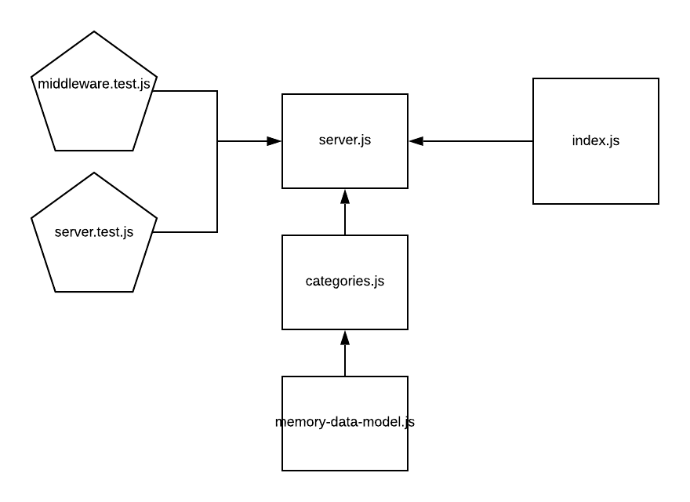

# LAB - 07

## API Server

### Author: David Vloedman

### Links and Resources

* [submission PR](https://github.com/david-vloedman-401-advanced-javascript/lab-07-api-server/pull/1)
* [travis](https://www.travis-ci.com/david-vloedman-401-advanced-javascript/lab-07-api-server)

#### Documentation

[Docs Index](./docs/index.html)

### Setup

* npm install

#### How to initialize/run your server app (where applicable)

* npm start
  
#### Tests

* npm test

#### UML

